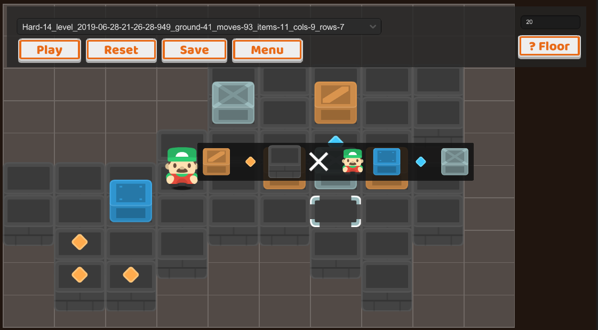

# Warehouse Dash - Sokoban

## About

This repository contains source code for a Unity game influenced by the game "Sokoban". There are compatible builds for Android and iOS phones, with additional functionality support for Android TV. The application is publically free to download on the following app stores:

* [Google Play (Android Phone, TV)](https://play.google.com/store/apps/details?id=gg.graphite.sokoban)
* [Apple App Store](https://apps.apple.com/us/app/warehouse-dash/id1471253538?ls=1)

Note: Sound effects are empty placeholders due to distribution restrictions.

## Noteworthy Features

* Grid-based gameplay: Control one GameObject and push other GameObjects around
* Level editor: Load/save levels to json, test levels during creation
* Local IO filesystem using json serialization (works across Editor/PC/Mobile)
* Runtime localization for 8 different languages (using StreamingAssets and Application.systemLanguage); works on mobile
* Runtime evaluation for gamepad input (determine if the user is using a TV remote)
* In-app purchase lifecycle for non-consumables: Ability to purchase, and functionality to grant and restore IAPs.
* Example of interstitial unity advertisements between levels.
* Modified version of [Instant Screenshot](https://assetstore.unity.com/packages/tools/instant-screenshot-24122): Support for 2019.1.9f1, capture iPhone/iPad/Android Phone/Android TV images with a single click

## Install

* Requires Unity 2019.1.9f1
* Clone and open the project in Unity
* Open the services panel and add a Project ID (to resolve ads/purchasing compile errors)
* Restart the editor

## Scenes

* Title scene - Entry scene; toggles between the "Main Menu" panel and a "Level Select" panel
* Editor scene - Allows new levels to be quickly created and exported. This scene is intended to be ran only from the Unity editor. However, the exported files (Assets\Resources\Data\Levels) may be included in the game once they are included in a difficulty folder (Easy/Medium/Hard).
* Game scene - Gameplay; builds and plays a predefined level (as set by the "Level Select" panel or Editor scene).
* Ad scene - Dedicated empty scene for running ads. Fail-safe "Continue" after a specific timeout.
